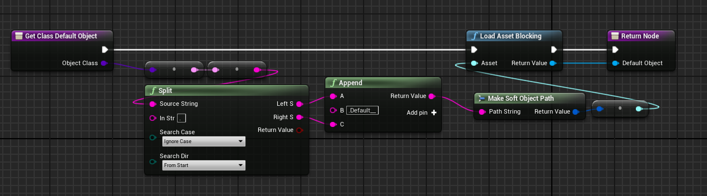
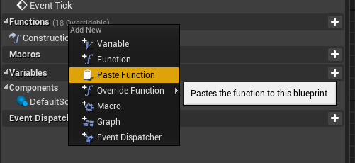
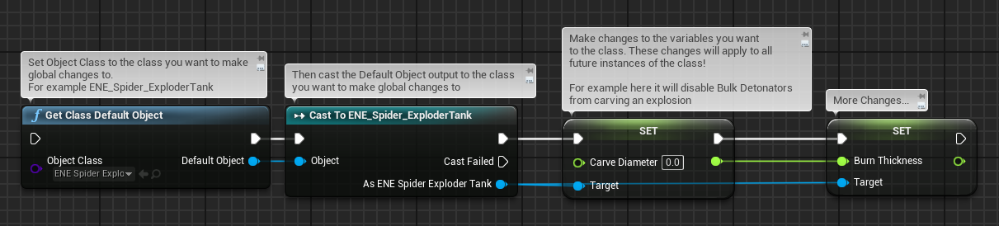
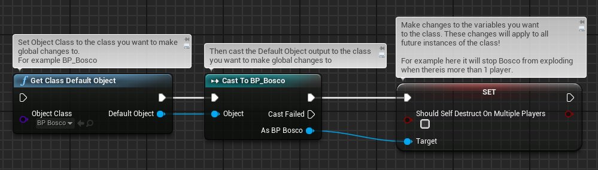
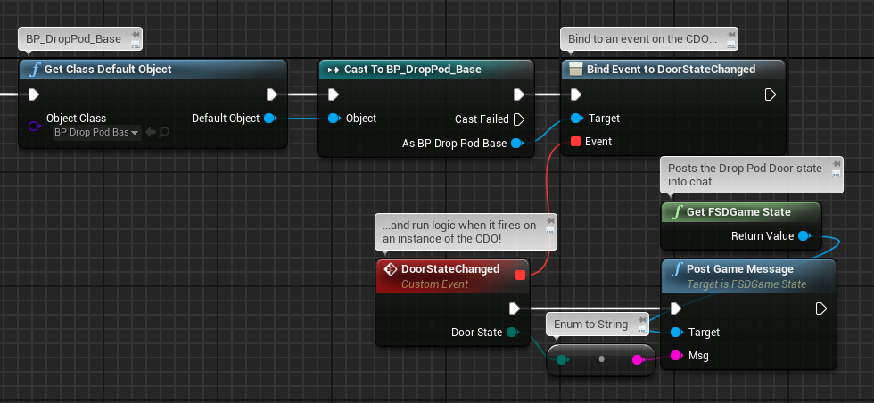
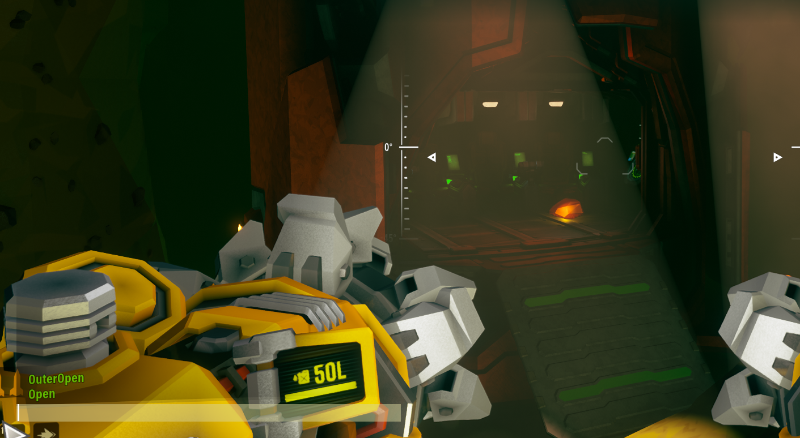
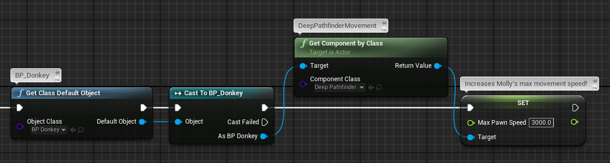
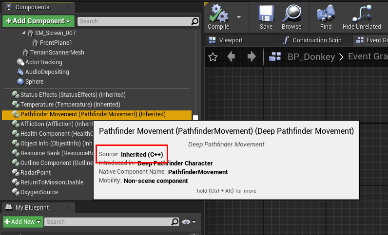

# Class Default Objects

> Please do not hesitate to ask for help! You can find talented modders in the [DRG RND Discord](https://discord.gg/tmFJcesA6d) or the [DRG Modder's Guild Discord](https://discord.gg/nkPhp2sZfd).
>
> ****Credits:****\
> [GoldBl4d3](https://mod.io/g/drg/u/goldbl4d3) - provided the original CDO function in this guide\
> [mitgobla (Ben)](https://github.com/ben-dodd-dev) - wrote this guide

Class Default Objects (CDOs) are instances of Unreal Engine's `UClass`, which is the base class for all objects and blueprints. A CDO holds the default values for all properties of its class. Every `UClass` automatically has a CDO, which is used to initialize new instances of that class with their default property values. CDOs are important in DRG modding because they allow you to:

- Change default class variables, where these changes apply globally to all future instances of the class.
- Modify properties of components on the class (if those components are inhereted through C++)
- Bind to events on the class. Blueprint code will be triggered on the event for all future instances of the class.
- Make changes to classes that you can't easily obtain references of using methods.

# Contents

- [CDO Function](#cdo-function)
- [Add to your project](#add-to-your-project)
- [Example Usage](#example-usage)
  - [Edit CDO variables](#edit-cdo-variables)
  - [Bind to CDO Events](#bind-to-cdo-events)
  - [Modify CDO inherited Components](#modify-cdo-inherited-components)
- [Closing Note](#closing-note)

## CDO Function

The function does the following:
1. Gets the soft class reference of the input Object Class,
2. Converts it to a String,
3. Splits the string on the `.` character,
4. Inserts `.Default__` in the middle of the split,
5. Converts the joined string back into a Soft Object Path,
6. Loads the asset of the Soft Object Reference from the Soft Object Path,
7. Returns the loaded asset, which in this case is the Class Default Object!

## Add to your project

1. Copy the contents of the [Function Code](cdo/cdo-func.txt) file (Select all and then copy).
2. Open a blueprint or a Blueprint Function Library.
3. Right-click "Functions" and select "Paste".

    

4. The "Get Class Default Object" function should now be available to use in your blueprints.

## Example Usage

Ideally, the CDO function should be used as early as possible in your mod's lifecycle. For example, changes to CDOs should be done after "Event BeginPlay" within your mod blueprint. This is so your changes are set before any instances of the class you are modifying have spawned in.

### Edit CDO variables

Remove Bulk Detonator explosion carve:

This uses the "Get Class Default Object" function, which returns the CDO. The return type is "Object", so it must be cast into the type of class you set for the input. 

In this example, it is cast to "ENE_Spider_ExploderTank".

Once casted, you can make changes to variables on the output object of the cast. Here it is setting the Carve Diameter and Burn Thickness to 0, which removes the terrain carve created by Bulk Detonators exploding.

Another example, which stops Bosco exploding in multiplayer:

### Bind to CDO Events 

You can execute blueprint logic when an event is triggered on an instance of the CDO.

It's worth noting that some objects spawn earlier than your mod. This means if no new instances of the class are spawned, then your binding will not fire.

### Modify CDO inherited Components

This increases Molly's maximum movement speed, allowing her to zoom!

You can check if a component is inherited via C++ by hovering over the component in the editor. Unfortunately I don't have an explanation why components added in the editor cannot be modified through CDOs.

## Closing Note

CDOs and their capabilites in DRG modding have not been explored in-depth. If you discover something interesting that can be done with this function, please share! It would be great to get more examples added to this page.

