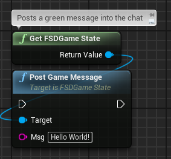
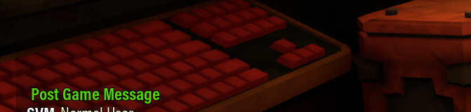
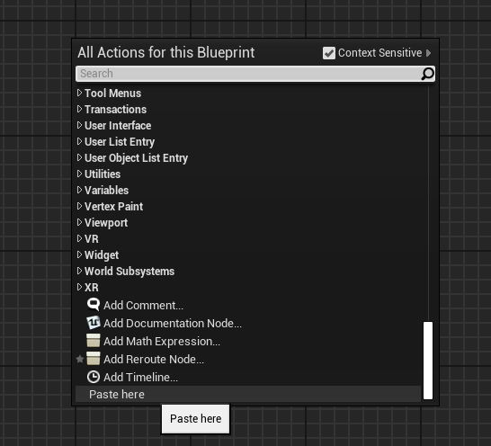
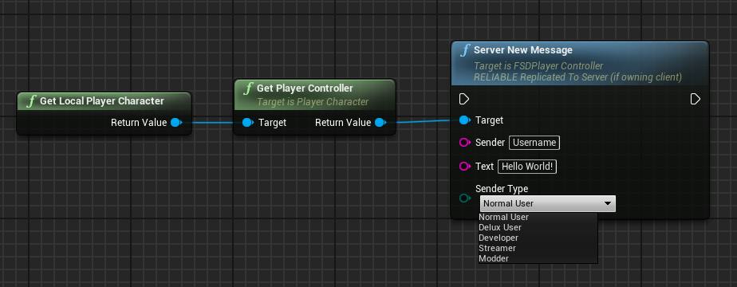
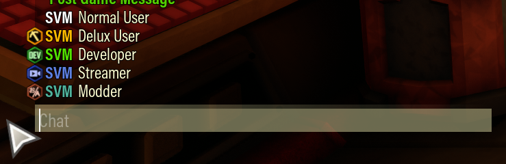
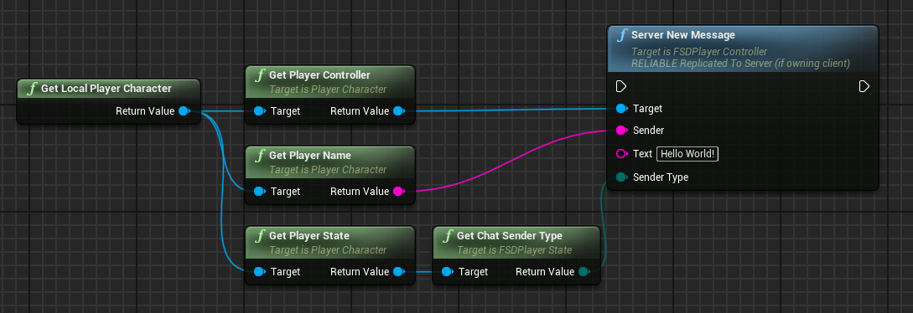

# Send Chat Messages

> Please do not hesitate to ask for help! You can find talented modders in the [DRG RND Discord](https://discord.gg/tmFJcesA6d) or the [DRG Modder's Guild Discord](https://discord.gg/nkPhp2sZfd).
>
> ****Credits:****\
> [mitgobla (Ben)](https://github.com/ben-dodd-dev) - wrote this guide

# Contents

- [Ways to send messages](#ways-to-send-messages)
  - [Post Game Message](#post-game-message)
    - [Parameters](#parameters)
    - [Preview](#preview)
    - [Add to your project](#add-to-your-project)
  - [Server New Message](#server-new-message)
    - [Parameters](#parameters-1)
    - [Preview](#preview-1)
    - [Add to your project](#add-to-your-project-1)
  - [Send a message from yourself](#send-a-message-from-yourself)
    - [Add to your project](#add-to-your-project-2)

## Ways to send messages

There are a few ways to send a message in the chat window. They differ in appearance and who can send or see the message.

Some terms to note in this guide:

- **Host**: The hosting player, running the lobby for other players to join. You are the host when you're playing singleplayer.
- **Client**: Other players who join your lobby, or you when you are in a lobby hosted by someone else.

### Post Game Message

A game message appears as bold green text in the chat window. This method can only be used by the **host**. If you use this function as a client, nobody else will see the message.

#### Parameters

The parameters are the following:

- **Target**: The FSDGame State instance, usually "Get FSDGame State" is sufficient.
- **Msg**: The message to send into the chat window.

#### Preview

#### Add to your project

1. Copy the contents of the [Logic Code](chat/chat-post-game-message.txt) file (Select all and then copy).
2. Open a blueprint.
3. Right-click and select "Paste here".

    

4. The blueprint logic should now be available to use in your blueprint.

### Server New Message

This method provides more customisation on how the message appears in the chat window.

This is used for the messages that you see when chatting with other players.

This method can be used by the **host** and the **client**, meaning you can send messages using this method in a lobby where you are not the host. **Don't abuse this - you'll likely get kicked from the lobby!**

#### Parameters

The parameters are the following:

- **Target**: The player controller to trigger sending the message. Using the local player character's controller is sufficient in most cases.
- **Sender**: The name to appear as the sender of the message.
- **Text**: The message to send in the chat window.
- **Sender Type**: This changes the icon that appears next to the sender name.
  - **Normal User**: A regular user. No icon.
  - **Delux User**: A user who has purchased supporter DLCs. Golden pickaxe icon.
  - **Developer**: A developer of the game. Green DEV icon.
  - **Streamer**: A content creator for the game. Blue camera icon.
  - **Modder**: Contradictory to the name, this is a translator role. Red translator icon.

#### Preview

Here is what these look like. where the "Sender" parameter is set as "SVM":

#### Add to your project

1. Copy the contents of the [Logic Code](chat/chat-server-new-message.txt) file (Select all and then copy).
2. Open a blueprint.
3. Right-click and select "Paste here".

    

4. The blueprint logic should now be available to use in your blueprint.

### Send a message from yourself

Using [Server New Message](#server-new-message), you can send chat messages as yourself with the following blueprint logic:

As mentioned previously, please don't abuse this. Players don't like their chat being spammed with automated messages. You'll likely end up being kicked!

#### Add to your project

1. Copy the contents of the [Logic Code](chat/chat-message-as-yourself.txt) file (Select all and then copy).
2. Open a blueprint.
3. Right-click and select "Paste here".

    

4. The blueprint logic should now be available to use in your blueprint.
